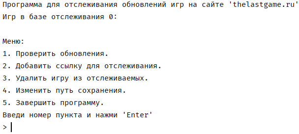

# GameUpdateProgram
Небольшая консольная Windows-программа для проверки вышедших обновлений игр на сайте https://thelastgame.ru и дайльнейшего скачивания торрент-файла в необходимый каталог.

GameUpdateProgram написана на Java, для её работы должна быть установлена [Java](https://www.java.com/ru/download/).

### *Принцип работы GameUpdateProgram*
GameUpdateProgram при запуске программы загружает список отслеживаемых игр из файла **sitelist.json**. По требованию пользователя парсит каждый сайт из списка, сравнивая даты последних обновлений в файле и на сайте.
Если дата обновления игры на сайте новее даты в файле *sitelist.json*, то программа скачивает торрент-файл и обновляет дату последнего обновления игры в файле *sitelist.json*.
При отсутствии ссылки на игру в списке отслеживаем, GameUpdateProgram добавляет игру в список, скачивает торрент-файл и сохраняет изменения в *sitelist.json*.
Есть файл *sitelist.json* отсуствует, программа создаст его при первом запуске.

### *Как скачать jar-файл программы*
GameUpdateProgram упакована в один jar-файл и находится в каталоге **out**. Там же находятся файлы *sitelist.json* и *config.ini*. 

### *Запуск файла и работа с программой*
GameUpdateProgram является консольной программой, запуск осуществляется в консоле Windows командой:
>java -jar \Путь_к_файлу\GameUpdateProgram.jar

При наличие ссылок на игры в файле sitelist.json программа выведет список отслеживаемых игр.

> *Путь сохранения торрент-файлов указывается в **config.ini**. Сам файл должен находится в одном каталоге с jar-файлом. При его отсутствии, при первом запуске программы будет создан новый config-файл, в котором в качестве пути сохранения торрент-файлов будет каталог с jar-файлом.
Изменить путь сохранения торрент-файлов можно в программе или путём редактирования **config.ini**. Путь сохранения торрент-файлов не должен содержать символы кирилицы!*

Далее необходимо ввести на клавиатуре номер пункта меню и нажать 'enter'.
